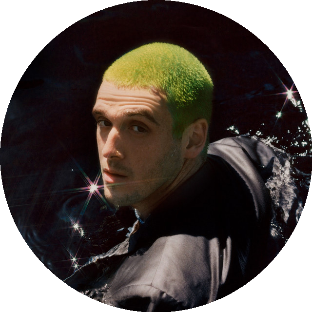
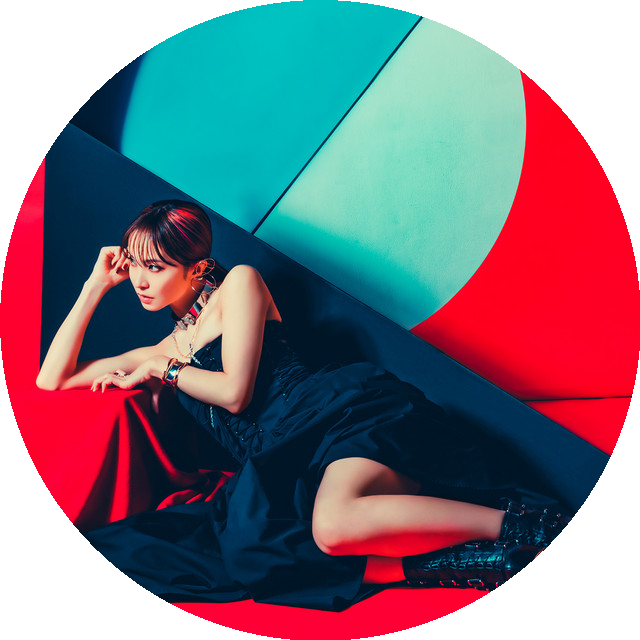

<!--  -->
<h1 align='center'>
   
  
   
  Sogi
   
</h1>

<h4 align='center'>Life does not get better by chance, it gets better by change. - <a href='https://duckduckgo.com/?q=Jim+Rohn' target='_blank'>Jim Rohn</a>.</h4>

  
  

<h1 float='left'>
   
  Top artists this month
  

  

    
    <h6>The Weeknd</h6>
  

  

    
    <h6>Lauv</h6>
  

  

    
    <h6>LiSA</h6>
  <!-- 

  

    
    <h6>James Arthur</h6>
  

  

    
    <h6>Joji</h6>
  
 -->

</h1>
